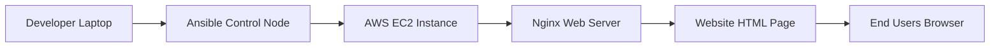
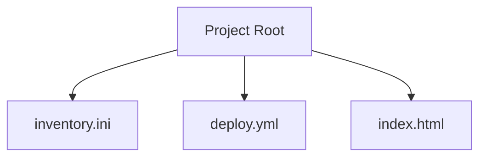
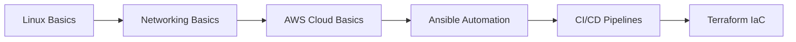

<!-- PROJECT BANNER -->
<h1 align="center">🚀 Cloud Web Deployment Using Ansible</h1>
<h3 align="center">Automating Cloud Infrastructure & Web Deployment</h3>

---

## 🧑‍💻 Author

**Arkan Tandel**  
📍 Pune, India  
📧 arkantandel@gmail.com  
🔗 LinkedIn: https://linkedin.com/in/arkantandel  
🔗 GitHub: https://github.com/arkantandel  

---

## 🏷 Project Badges


---

# 🌟 Project Overview

This project demonstrates **Real World DevOps Cloud Deployment** using:

- ☁ AWS EC2 Cloud Server  
- ⚙ Ansible Automation Tool  
- 🌐 Nginx Web Server  
- 📄 HTML Website Deployment  

This project simulates how DevOps engineers deploy web applications automatically in production environments.

---

# 🧠 Key DevOps Concepts Used

✔ Infrastructure as Code  
✔ Configuration Management  
✔ Cloud Automation  
✔ Web Deployment Automation  
✔ Remote Server Management  

---

# 🏗️ Architecture Diagram



---

# 📂 Project Structure



---

# ⚙️ Installation & Setup

---

## 🖥 Step 1 — Update System
```bash
sudo apt update -y
```

👉 Updates system package repository.

---

## ⚙ Step 2 — Install Ansible
```bash
sudo apt install ansible -y
```

👉 Installs automation engine.

---

# ☁ Step 3 — Create AWS EC2

### Configure:

- Ubuntu Server  
- Allow SSH (22)  
- Allow HTTP (80)  

---

# 🔐 Step 4 — Setup SSH Access

```bash
chmod 400 key.pem
ssh -i key.pem ubuntu@SERVER_IP
```

👉 Secure connection to cloud server.

---

# 📄 Step 5 — Create Inventory File

### inventory.ini
```ini
[production]
server1 ansible_host=YOUR_SERVER_IP ansible_user=ubuntu
```

---

# 📄 Step 6 — Create Deployment Playbook

### deploy.yml
```yaml
---
- name: Configure Nginx Web Server
  hosts: production
  become: yes

  tasks:

    - name: Install nginx
      apt:
        name: nginx
        state: latest
        update_cache: yes

    - name: Start nginx
      service:
        name: nginx
        state: started
        enabled: yes

    - name: Deploy Website
      copy:
        src: index.html
        dest: /var/www/html/index.html
```

---

# 📄 Step 7 — Create Website File

### index.html
```html
<h1>🚀 Website Deployed Using Ansible Automation</h1>
```

---

# 🚀 Step 8 — Run Deployment

```bash
ansible-playbook -i inventory.ini deploy.yml
```

---

# 🌐 Verify Deployment

Open in browser:

```
http://SERVER_IP
```

---

# 📚 Learning Roadmap



---

# 🎯 Benefits of This Project

✅ Real Industry DevOps Workflow  
✅ Hands-on Cloud Experience  
✅ Automation Skills  
✅ Resume Strong Project  
✅ GitHub Portfolio Enhancement  

---

# 💼 Resume Project Title

**Automated Cloud Web Deployment Using Ansible and AWS EC2**

---

# 🔥 Future Enhancements

- CI/CD Integration  
- Multi Server Deployment  
- Ansible Roles Implementation  
- Terraform + Ansible Integration  
- Docker Deployment  

---

# ❤️ DevOps Philosophy

> Automate Everything.  
> Reduce Manual Errors.  
> Scale Infrastructure Easily.  

---

# ⭐ Final Summary

This project demonstrates real-world cloud automation using Ansible to deploy and configure web infrastructure efficiently and reliably.

---

