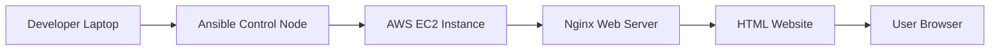
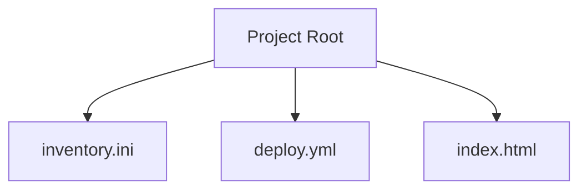
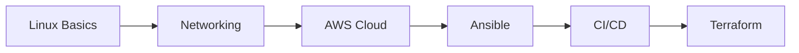

<!-- BIG BANNER -->
<p align="center">
  
</p>

---

<h1 align="center">🚀 Automated Cloud Web Deployment</h1>
<h3 align="center">AWS EC2 + Ansible + Nginx + HTML Deployment</h3>

---

## 👨‍💻 Author

| Name | Role | Location |
|---|---|---|
| **Arkan Tandel** | DevOps Engineer (Fresher) | Pune, India |

📧 Email: arkantandel@gmail.com  
🔗 LinkedIn: https://linkedin.com/in/arkantandel  
🔗 GitHub: https://github.com/arkantandel  

---

## 🏷 Tech Stack Badges


---

# 🌟 Project Overview

This project demonstrates **Real World DevOps Cloud Automation** using:

✅ AWS EC2 Cloud Infrastructure  
✅ Ansible Configuration Management  
✅ Nginx Web Server Automation  
✅ HTML Website Deployment  


# 🏗️ Architecture Diagram



---

# 📂 Project Structure



---

# ⚙️ Installation Steps

---

## 🖥 Update System
```bash
sudo apt update -y
```

---

## ⚙ Install Ansible
```bash
sudo apt install ansible -y
```

---

# ☁ AWS EC2 Setup

Create Instance:

- Ubuntu Server  
- Open Port 22 (SSH)  
- Open Port 80 (HTTP)  

---

# 🔐 SSH Access

```bash
chmod 400 key.pem
ssh -i key.pem ubuntu@SERVER_IP
```

---

# 📄 Inventory Configuration

```ini
[production]
server1 ansible_host=YOUR_SERVER_IP ansible_user=ubuntu
```

---

# 📄 Deployment Playbook

```yaml
---
- name: Configure Nginx Web Server
  hosts: production
  become: yes

  tasks:

    - name: Install nginx
      apt:
        name: nginx
        state: latest
        update_cache: yes

    - name: Start nginx
      service:
        name: nginx
        state: started
        enabled: yes

    - name: Deploy Website
      copy:
        src: index.html
        dest: /var/www/html/index.html
```

---

# 📄 Website File

```html
<h1>🚀 Website Deployed Using Ansible</h1>
```

---

# 🚀 Deployment Command

```bash
ansible-playbook -i inventory.ini deploy.yml
```

---

# 🌐 Access Website

```
http://SERVER_IP
```

---

# 📚 DevOps Learning Path



---

# 🎯 Benefits

✅ Industry Level Automation Experience  
✅ Cloud Hands-on Experience  
✅ DevOps Real Workflow  
✅ Strong Resume Project  
✅ GitHub Portfolio Project  

---

# 🔥 Future Enhancements

- CI/CD Pipeline Integration  
- Docker Container Deployment  
- Terraform Infrastructure Automation  
- Multi Server Deployment  
- Ansible Roles Implementation  

---

# 💼 Resume Project Title

**Automated Cloud Web Deployment Using Ansible and AWS EC2**

---

# ❤️ DevOps Quote

> "Automation is not optional. It is survival in modern infrastructure."

---

<!-- FOOTER BANNER -->

<p align="center">
  
</p>

